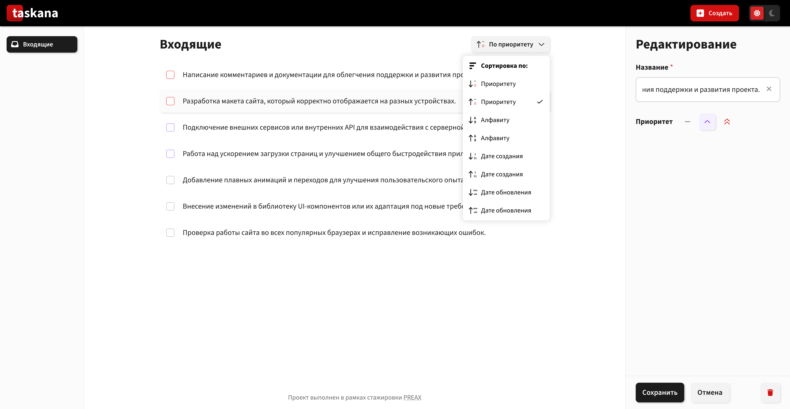
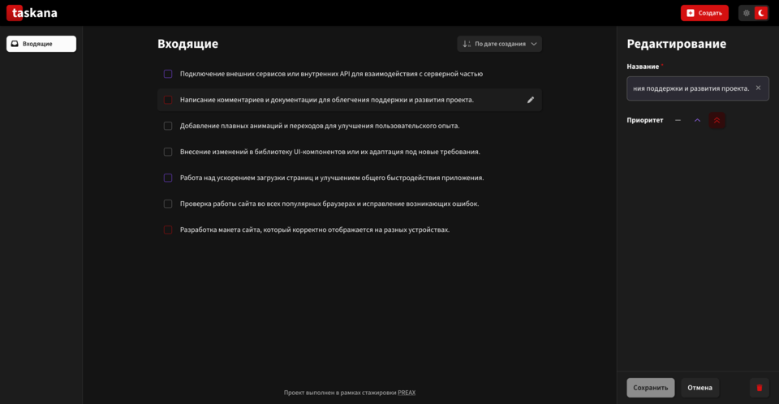

# Preax - TaskanaApp

Это решение задачи на [спринт TaskanaApp на Preax](https://preax.ru 'Preax'). Платформа Preax помогает улучшить навыки программирования путем создания реалистичных проектов.

TaskanaApp - это клиентское React-приложение для управления входящими задачами.

Основные возможности:

- просмотр списка входящих задач
- создание новой задачи
- редактирование существующей задачи
- удаление задачи
- сортировка задач по приоритету, алфавиту, дате создания и дате обновления

## Оглавление

- [Контакты](#контакты)
- [Запуск проекта](#инструкция-по-запуску-проекта)
- [Проект](#проект)
  - [Стек](#стек)
  - [Структура проекта](#структура-проекта)
  - [Архитектура](#Архитектура)
    - [Провайдеры состояния](#провайдеры-состояния)
    - [Основной UI поток](#основной-UI-поток)
  - [Кастомные хуки/hooks](#кастомные-hooks)
    - [useTaskEditorActions](#useTaskEditorActions)
    - [useTaskForm](#useTaskForm)
    - [useAutoFocus](#useAutoFocus)
    - [useOutsideInteraction](#useOutsideInteraction)
  - [Утилиты/utils](#утилиты)
    - [sortItems](#sortItems)
    - [createTask](#createTask)
    - [generateId](#generateId)
    - [clsx](#clsx)
  - [Тестовые данные](#данные)
  - [Скриншоты](#скриншоты)
  - [Live server url Versel](#Live-server)

## Контакты

- name - Marsel
- nickname - marsel-shakirov
- Telegram - @MarselShakirov
- GitHub - [Github](https://github.com/marsel-shakirov)

## Инструкция по запуску проекта

1. Установить зависимости (ввести инструкция в терминал `npm install`)
2. Запустить проект (ввести инструкцию в терминал `npm run dev`)
3. Собрать проект (ввести инструкцию `npm run build`)

## Проект

Работа реализована только для desktop без адаптива

### Стек

- `React 19`
- `Vite 6`
- `ESLint`
- `CSS Modules`
- `Context API`

### Структура проекта

```text
src/
  assets/        Глобальные стили, шрифты, иконки
  components/    UI-компоненты приложения
  constants/     Константы и конфигурации сортировки/иконок
  contexts/      Глобальные React context-провайдеры
  hooks/         Кастомные React hooks
  layouts/       Компоновка страниц
  mocks/         Mock-данные для локальной разработки
  pages/         Страницы приложения
  utils/         Вспомогательные функции
```

### Архитектура

#### Провайдеры состояния

В проекте используются два основных context-провайдера:

- [TasksProvider.jsx](src/contexts/tasksProvider/TasksProvider.jsx)
  Отвечает за:
  - список задач `tasks`
  - выбранную сортировку `filterSelected`
  - методы `setTasks` и `setFilterSelected`
  - загрузку mock-данных через `isMockData`

- [EditorProvider.jsx](src/contexts/editorProvider/EditorProvider.jsx)
  Отвечает за:
  - режим редактора `editorMode`
  - id редактируемой задачи `editingTaskId`

Экспорт общих хуков для работы с контекстом находится в [src/contexts/index.js](src/contexts/index.js).

#### Основной UI поток

1. Приложение инициализируется в `main.jsx`.
2. В `App.jsx` подключаются `EditorProvider` и `TasksProvider`.
3. `AppLayout` рендерит общий каркас приложения.
4. Компонент `Content` собирает основную страницу:
   - `NavBar`
   - `IncomingTasks`
   - `SideBar`
   - `TaskEditor`
5. Внутри `IncomingTasks` отображаются:
   - `MainContainer` со списком задач или пустым состоянием
   - `Footer`

### Кастомные hooks

#### useTaskEditorActions

[useTaskEditorActions.jsx](src/hooks/useTaskEditorActions.jsx)

Инкапсулирует действия редактора:

- `openEditorWithDelay`
- `closeEditorWithDelay`
- `createTaskWithDelay`
- `updateTaskWithDelay`
- `deleteTask`

В хуке используется искусственная задержка, чтобы UI мог показать loading-состояние.

#### useTaskForm

[useTaskForm.jsx](src/hooks/useTaskForm.jsx)

Отвечает за:

- состояние формы
- обновление полей
- reset формы
- валидацию
- вычисление `isDirty`

#### useAutoFocus

[useAutoFocus.jsx](src/hooks/useAutoFocus.jsx)

Ставит фокус на поле ввода при открытии редактора.

#### useOutsideInteraction

[useOutsideInteraction.jsx](src/hooks/useOutsideInteraction.jsx)

Универсальный hook для закрытия интерактивных элементов при взаимодействии вне их области.

### Утилиты

#### sortItems

[sortItems.js](src/utils/sortItems.js)

Сортирует задачи по конфигурации из `DROPDOWN_ICONS`.

Поддерживает сортировку:

- `priority`
- `alphabet`
- `create`
- `update`

#### createTask

[createTask.js](src/utils/createTask.js)

Создаёт объект новой задачи.

#### generateId

[generateId.js](src/utils/generateId.js)

Генерирует уникальный id для новых задач.

#### clsx

[clsx.js](src/utils/clsx.js)

Простая реализация clsx которая позволяет вам передавать имена классов в виде строк или объектов с условиями, а на выходе получать готовый css module

```jsx
		className={clsx(styles, // обязательный первый параметр
		 'button', {
			active: isActive,
			disabled: isDisabled, // Класс 'disabled' будет применен, если isDisabled === true
		})}
```

### Данные

Mock-данные находятся в [src/mocks/tasks.mock.js](/src/mocks/tasks.mock.js).

Можно передать props isMockData={true}, чтобы было проще проверить работу:

```jsx
<TasksProvider isMockData={true}>
```

### Скриншоты

- Desktop
  
  
  

### Live server

- Live Site URL **Versel**: [TaskanaApp](taskana-app-1-preax.vercel.app 'TaskanaApp')
